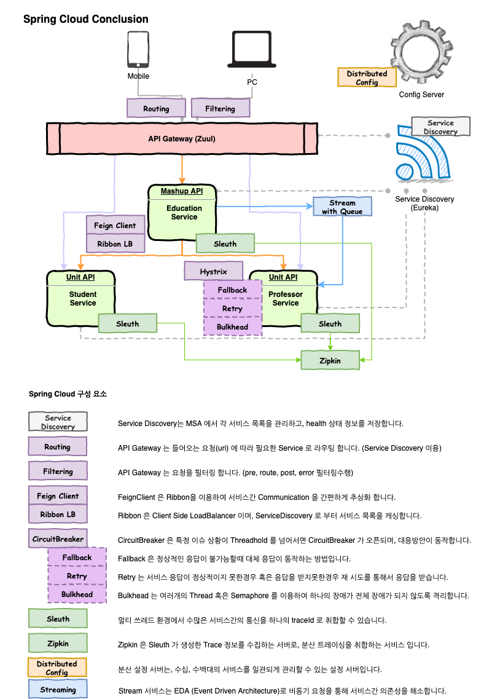
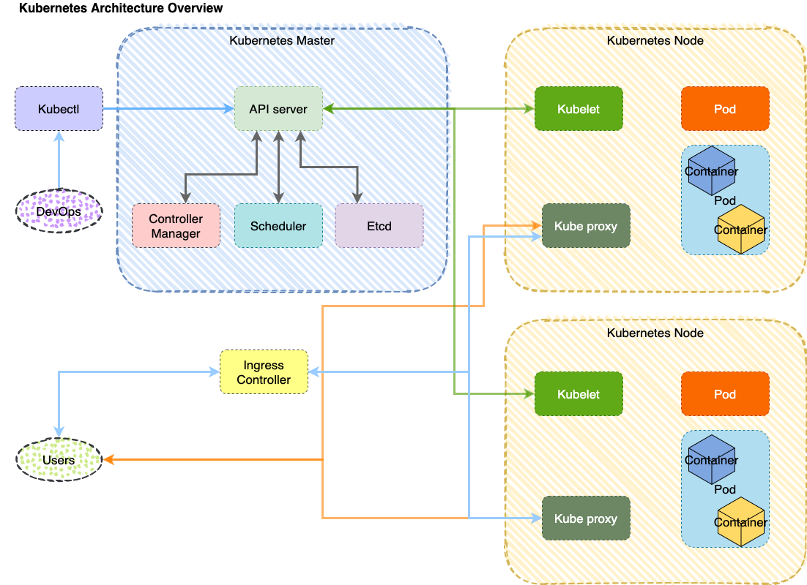
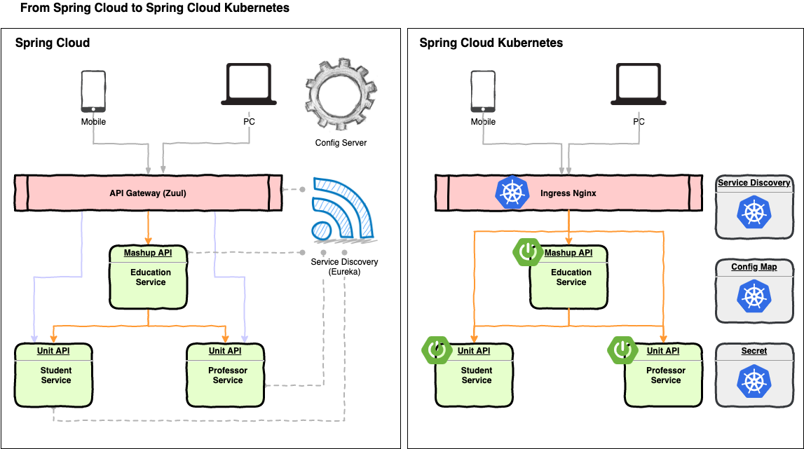

# SpringCloud Kubernetes

Kubernetes 사용이 확대되면서, Spring 에서도 SpringCloud와 Kubernetes 통합을 위한 오픈소스 활동이 활발해 지고 있습니다. 

SpringCloud Kubernetes 를 살펴보면서 Kubernetes 클러스터 상에서 어떻게 SpringCloud가 동작하는지 이해하는 시간을 가지고자 합니다. 

- Agenda 는 다음과 같습니다 .
    - SpringCloud Architecture Overview
    - Kubernetes Architecture Overview
    - SpringCloud Kubernetes 소개
    - SpringCloud 적용 예제
    
## SpringCloud Architecture Overview

스프링 클라우드는 MSA 구성을 위해서 SPRING 을 사용하기 위한 다양한 도구들을 지원합니다. 

스프링 클라우드 아키텍처는 위와 같은 구조를 가집니다. 

| 구성요소 | 설명 |
| :--- | :--- |
| Service Discovery | Service Discovery는 MSA 에서 각 서비스 목록을 관리하고, health 상태 정보를 저장합니다. |
| Api Gateway Routing | API Gateway 는 들어오는 요청(uri) 에 따라 필요한 Service 로 라우팅 합니다. (Service Discovery 이용) | 
| Api Gateway Filter | API Gateway 는 요청을 필터링 합니다. (pre, route, post, error 필터링수행) |
| Client Side Loadbalancer Ribbon | Ribbon 은 Client Side LoadBalancer 이며, ServiceDiscovery 로 부터 서비스 목록을 캐싱합니다. |
| Client Side Loadbalancer Feign | FeignClient 은 Ribbon을 이용하여 서비스간 Communication 을 간편하게 추상화 합니다.  |
| Circuit Breaker |  CircuitBreaker 은 특정 이슈 상황이 Threadhold 를 넘어서면 CircuitBreaker 가 오픈되며, 대응방안이 동작합니다.  |
| Circuit Breaker Fallback | Fallback 은 정상적인 응답이 불가능할때 대체 응답이 동작하는 방법입니다. |
| Circuit Breaker Retry | Retry 는 서비스 응답이 정상적이지 못한경우 혹은 응답을 받지못한경우 재 시도를 통해서 응답을 받습니다. |
| Circuit Breaker Bulkhead | Bulkhead 는 여러개의 Thread 혹은 Semaphore 를 이용하여 하나의 장애가 전체 장애가 되지 않도록 격리합니다. |
| Distributed Trace Sleuth | 멀티 쓰레드 환경에서 수많은 서비스간의 통신을 하나의 traceId 로 취합할 수 있습니다.  |
| Distributed Trace Zipkin | Zipkin 은 Sleuth 가 생성한 Trace 정보를 수집하는 서버로, 분산 트레이싱을 취합하는 서비스 입니다. |
| Distributed Config | 분산 설정 서버는, 수십, 수백대의 서비스를 일관되게 관리할 수 있는 설정 서버입니다.  |
| Streaming | Stream 서비스는 EDA (Event Driven Architecture)로 비동기 요청을 통해 서비스간 의존성을 해소합니다. |

상기 나열된 각 기능들을 활용하여, Spring Cloud 기반의 MSA 를 구축할 수 있게 됩니다. 

참고: SpringCloud Architecture 의 자세한 구현체와 설명은 다음 자료를 참조하세요.
 
https://github.com/unclebae/SpringCloudCourse

## Kubernetes Architecture

SpringCloud Kubernetes 를 활용하기 위해서 기본적인 Kubernetes Architecture 을 살펴볼 필요가 있습니다. 

Kubernetes 의 전체적인 아키텍처 개요는 아래와 같습니다. 

| ~ | Component | Description |
| :--- | :--- | :--- |
| Master | API Server | Kubernetes 의 모든 컴포넌트들은 API Server 와 통신합니다. 외부 오퍼레이션을 받아들이거나, 각 Node 에 Pod 설치 명령을 내리는 역할, 각 노드들의 상태를 저장하거나, 상태에 따라 새로운 노드를 배포하는 역할을 위해 통신하는 게이트웨이 역할을 합니다.  |
|^ | Controller Manager | Node Controller(노드 다운에 대한 감시), Replication Controller(원하는 복제 계수에 대한 모니터링을 수행), Endpoint Controller(엔드포인트 객체 노출, 서비스/파드 조인), Service Account & Token Controller(기본 어카운트 생성, API 접근을 위한 토큰 생성등을 수행)  |
|^ | Scheduler | 노드들의 자원 상태를 감시합니다. 이를 통해 노드에 새로운 포드를 배포할 수 있도록 정책을 관리합니다. 또한 리소스 요구사항을 수집하고, 하드웨어, 소프트웨어, 정책 제한, 어피티니/안티어피니티 정책, 워크로드 인터페이스 등의 팩터들을 수집하여 이를 통해 스케줄링을 합니다. | 
|^ | Etcd | 고가용성 key-value 스토어로, 모든 클러스터의 데이터를 저장합니다. 또한 Config-Map, Secret 등도 저장합니다. |
||||
| Node | Kublet | 각 클러스터 노드에서 수행되는 에이전트입니다. 파드에서 컨테이너가 수행되도록 하거나, 파드 스펙에 따라 정상적으로 수행 되는지를 보장합니다.  |
|^ | Pod | Kubernetes 에서 배포의 최소단위 요소 입니다. Pod 안에서는 여러개의 컨테이너가 수행될 수 있으나, 기본적으로 하나의 Pod에 하나의 컨테이너를 권장합니다. |
|^ | Kube Proxy | 네트워크 프록시를 수행하며, 각 클러스터 노드에서 동작합니다. 이는 노드의 네트워크 룰을 관리합니다. Pod간 네트워크 통신을 담당하거나, 내부와 외부 연결을 담당하게 됩니다. |
||||
| - | Kubectl | kubectl 은 admin 하여금 api server 엔드포인트와 통신하도록 해주는 cli 툴 입니다. 대부분 이 툴을 이용하여 kubernetes 에 명령을 수행합니다.  |
| - | Ingress | Ingress 는 Kubernetes 로 들어오는 네트워크 엔드포인트로, 외부 사용자가 kubernetes 의 서비스로 L7 로드 밸런싱을 지원합니다. 인입되는 트래픽을 지정된 Rule에 따라서 어떠한 서비스 전달할지 룰을 지정하며, Ingress Controller 가 이 룰을 통해 라우팅을 수행할 수 있도록 해줍니다.  |

간략하게 Kubernetes 의 아키텍처를 알아 보았습니다. 

위 아키텍처의 구조를 유심히 살펴보면 SpringCloud과 Kubernetes 가 어떻게 통합되었는지 감을 잡을 수 있습니다. 

## SpringCloud vs SpringCloud Kubernetes

각각의 아키텍처를 알아 보았으니 이제 SpringCloud Kuberentes 가 SpringCloud와 어떻게 통합되는지 한번 알아보겠습니다. 

위 아키텍처에서 어떠한 부분이 다른지 한눈에 파악할 수 있습니다. 

SpringCloud 에서 제공하던 도구들중에서 Kubernetes 와 통합하면서 변경되는 부분은 다음과 같습니다 .

- ServiceDiscovery : 기존 SpringCloud 에서 사용하던 서비스 디스커버리(Eureka) 대신에 Kubernetes Api Server 을 통해서 각 서비스를 Discovery 할 수 있습니다. 
- ConfigMap : ConfigMap 을 통해서 SpringCloud의 ConfigServer 를 대체할 수 있으며, 실시간 Refresh 등을 수행할 수 있습니다. 
- Secret : Secret 은 Kubernetes 에서 암호화된 환경변수등을 관리하기 위한 도구로 ConfigServer 을 대체합니다. 
- API Gateway : SpringCloud 에서 제공하던 Zuul Proxy, SpringCloud Api Gateway 는 Kubernetes 의 Ingress 로 대체할 수 있습니다. 

위 아키텍처와 같이 각각의 서비스는 그대로 유지하면서, MSA 를 위해 필요한 몇가지 컴포넌트들을 Kuberentes 기능으로 대체하는 작업을 이제 진행해 보겠습니다 .

## Workshop

- [StudentService](https://github.com/schooldevops/SpringCloudKubernetes/tree/master/student-service)
    - Student-Service Project Overview
    - 소스 구조
    - SpringCloud 의존성 설정하기
    - Student-Service Packaging and Dockerizing
    - Student-Service with Mongodb
    - Kubernetes Secret 
    - Kubernetes Deploy Mongodb
    - Kubernetes Deployment
    - Kubernetes Service
    - Kubernetes Deploy Student-Service
    
- [ProfessorService](https://github.com/schooldevops/SpringCloudKubernetes/tree/master/professor-service)
    - Professor-Service Project Overview
    - 소스 구조
    - SpringCloud 의존성 설정하기
    - Professor-Service Packaging and Dockerizing (공통)
    - Kubernetes Deploy MysqlDB
    - Kubernetes Deploy Professor-Service
    
- [EducationService](https://github.com/schooldevops/SpringCloudKubernetes/tree/master/education-service)
    - Education-Service Project Overview
    - 소스 구조
    - SpringCloud 의존성 설정하기
    - Education-Service Packaging and Dockerizing (공통)
    - Kubernetes Discovery Client
    - Call Service Endpoint with Ribbon
    - Call Service Endpoint with FeignClient
    - Kubernetes with ConfigMap
    - Kubernetes with Sleuth
    - Kubernetes with Zipkin
    
- [Ingress](https://github.com/schooldevops/SpringCloudKubernetes/blob/master/README_INGRESS.md)
    - Install Ingress-nginx Controller
    - Set Ingress Rule Setting
    
- [Run Kubernetes Commands](https://github.com/schooldevops/SpringCloudKubernetes/blob/master/README_SERVER_RUN.md)
