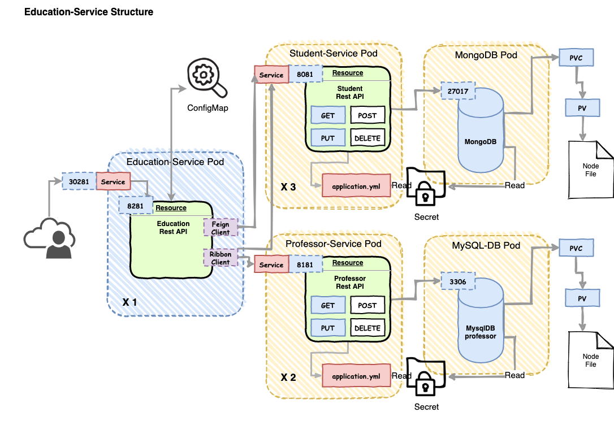

# EducationService

이제 EducationService 를 살펴 보겠습니다. 

이번부터 본격적으로 SpringCloud Kubernetes 라이브러리를 사용하게 될 것입니다. 

## Education-Service Project Overview



Education-Service 는 학사 서비스입니다. 학생과, 교수 정보를 릴레이해서 조회할 수 있으며, 과목 이름에 대해서 학생목록과, 교수 목록을 가져오는 API 도 구현 하고 있습니다. 

Education-Service 가 이용하는 라이브러리는 다음과 같습니다. 

- Discovery Client: Kubernetes Service 가 수집하고 있는 서비스 목록 정보를 조회할 수 있도록 지원합니다. 
- Ribbon Client: Ribbon Client 를 이용하면 Discovery Client 를 통해서 조회한 서비스 목록을 클라이언트에서 캐싱해 두었다가, Client Side Loadbalancing 해 줄 수 있습니다. 
- ConfigMap / Secret: Kubernetes 의 Etcd에 저장된 설정 정보들을 조회하여, SpringCloud 가 부트업 될때 혹은 Realtime Reload 를 통해 설정정보를 조회해 갈 수 있습니다. 

## 소스 구조

- education-service:
    - kubernetes: kubernetes 디플로이를 위한 매니페스트 파일이 존재합니다. 
        - education-config.yml: configMap 에 저장될 설정 정보를 저장합니다 .
        - education-service-deployment.yml: education-service pod를 디플로이하기 위한 매니페스트 파일입니다. Service, Deployment 를 지정하고 있습니다.
        - es-deployment.yml: elastic-search 를 디플로이하기 위한 매니페스트 파일입니다. (es는 zipkin의 저장소로 사용할 수 있습니다.)
        - zipkin-service-deplo싱yment.yml: zipkin은 분산 트레이싱을 위한 로그 수집기이며, 리퀘스트에 대한 시간에 따른 트레이, Latency 등을 측정할 수 있습니다.
    - src.main.docker: Dockerizing 위한 파일이 저장됩니다. 
    - src.main.java.xxx.config: 어플리케이션 설정 정보
        - PropertiesConfig: kubernetes 의 configMap과 연동하기 위한 설정이 들어갑니다.
        - models: RestAPI 를 통해 결과를 담을 모델 겍체, Student / Professor 에 대한 클래스
        - resources: 외부로 오픈할 엔드포인트로 RestController 입니다. 
        - service: 다른 서비스 Pod 와 연동하는 서비스 객체입니다 .
            - EducationService: Ribbon을 이용한 서비스 객체
            - StudentService: FeignClient 를 이용한 서비스 객체
        - EducationApplication: education Application을 띄울 엔트리 포인트 클래스입니다. 
        - resources:
            - http-test: 테스트용 HttpClient 설정을 담고 있습니다. 
            - application.yaml: 어플리케이션 프로퍼티를 지정합니다. 
            
## SpringCloud 의존성 설정하기

우선 SpringCloud Kubernetes 를 이용하기 위해서 필요한 의존성 ReleaseTrain 정보를 확인해 보겠습니다. 

### SpringCloud Cloud Dependency

pom.xml 파일에서 release train 을 설정합니다. 

즉 의존성 관리 설정을 다음과 같이 수행했습니다. 

```text
...
	<properties>
		<project.build.sourceEncoding>UTF-8</project.build.sourceEncoding>
		<java.version>14</java.version>
		<start-class>com.schooldevops.springcloud.kube.EducationApplication</start-class>
		<docker.image.name>unclebae/education-service</docker.image.name>
		<docker.image.tag>latest</docker.image.tag>
		<spring.cloud.k8s.version>1.1.3.RELEASE</spring.cloud.k8s.version>
		<spring-cloud-dependencies.version>Hoxton.SR5</spring-cloud-dependencies.version>
	</properties>

	<dependencyManagement>
		<dependencies>
			<dependency>
				<groupId>org.springframework.cloud</groupId>
				<artifactId>spring-cloud-dependencies</artifactId>
				<version>${spring-cloud-dependencies.version}</version>
				<type>pom</type>
				<scope>import</scope>
			</dependency>
			<dependency>
				<groupId>org.springframework.cloud</groupId>
				<artifactId>spring-cloud-kubernetes-dependencies</artifactId>
				<version>${spring.cloud.k8s.version}</version>
				<type>pom</type>
				<scope>import</scope>
			</dependency>
		</dependencies>
	</dependencyManagement>

...
```

현재 제가 사용한 버젼은 1.1.3 버젼입니다. 

이제 kubernetes 와 연동하기 위한 의존성 설정을 추가합니다 .

```text
...
		<dependency>
			<groupId>org.springframework.cloud</groupId>
			<artifactId>spring-cloud-starter-kubernetes-netflix</artifactId>
			<version>0.2.1.RELEASE</version>
		</dependency>

		<dependency>
			<groupId>org.springframework.cloud</groupId>
			<artifactId>spring-cloud-kubernetes-discovery</artifactId>
		</dependency>
		<dependency>
			<groupId>org.springframework.cloud</groupId>
			<artifactId>spring-cloud-starter-kubernetes-config</artifactId>
		</dependency>
		<dependency>
			<groupId>org.springframework.boot</groupId>
			<artifactId>spring-boot-configuration-processor</artifactId>
			<optional>true</optional>
		</dependency>
		<dependency>
			<groupId>org.springframework.cloud</groupId>
			<artifactId>spring-cloud-starter-kubernetes-ribbon</artifactId>
			<version>1.1.1.RELEASE</version>
		</dependency>
...
```

위 의존성은 서비스 디스커버리에 접근을 위한 DiscoveryClient, Ribbon, ConfigMap, Properties Resource 등을 같이 이용할 수 있도록 해줍니다. 

## Education-Service Packaging and Dockerizing (공통)

패키징과 Docker 이미지 생성은 Student-Service 을 참조하면 됩니다. 

```text
mvn clean package docker:build 를 통해서 이미지를 생성해 줍니다. 
```

## Kubernetes Discovery Client

MSA 에서 Discovery Client 기능은 가장 핵심적인 기능입니다. 

스프링 클라우드에서는 이러한 일을 EUREKA 를 통해서 살펴 보았습니다. Kubernetes 에서는 서비스 이름을 통해서 pod 서비스를 찾을 수 있으며, 

DNS 서비스를 통해서 이름을 통한 서비스 주소를 발견하는 메커니즘을 제공하고 있습니다. 

SpringCloud kubernetes 에서는 이러한 Discovery Client 를 위해서 Service 를 활용합니다. 위 그림에서 확인하신것과 같이 서비스를 등록해야, 해당 서비스 이름으로 서비스 목록으로 관리되며, 클라이언트에서 서비스 목록을 조회해 갈 수 있습니다. 

특정 서비스를 제거하고, 접속해 보면 500 에러를 반환합니다. 


````text
kubectl delete service student-service
````

위와 같이 student-service 를 제거하고, 다음과 같이 호출하면 오류가 발생합니다. 

```text
curl -v http://localhost:30281/api/educations/students 
```

결과로 500 에러가 납니다 .

로그를 살펴보면 student-service 를 발견하지 못했다고 나타납니다. 

```text
netflix.client.ClientException: Number of retries on next server exceeded max 1 retries, while making a call for: student-service:8081] with root cause

java.net.UnknownHostException: student-service
...
```

## Call Service Endpoint with Ribbon

그럼 우리 소스 중에서 Ribbon을 설정해 보겠습니다. 

이미 의존성을 추가해 주었기 때문에 다음과 같이 몇가지 어노테이션을 통해 활성화 해줍니다. 

EducationApplication.java

```text
package com.schooldevops.springcloud.kube;

import org.springframework.boot.SpringApplication;
import org.springframework.boot.autoconfigure.SpringBootApplication;
import org.springframework.cloud.client.discovery.EnableDiscoveryClient;
import org.springframework.cloud.client.loadbalancer.LoadBalanced;
import org.springframework.cloud.netflix.ribbon.RibbonClient;
import org.springframework.cloud.openfeign.EnableFeignClients;
import org.springframework.context.annotation.Bean;
import org.springframework.web.client.RestTemplate;

@EnableDiscoveryClient
@EnableFeignClients
@SpringBootApplication
@RibbonClient(name = "student-service,professor-service")
public class EducationApplication {

	@LoadBalanced
	@Bean
	RestTemplate restTemplate() {
		return new RestTemplate();
	}

	public static void main(String[] args) {
		SpringApplication.run(EducationApplication.class, args);
	}

}
```

- @EnableDiscoveryClient: 이 어노테이션을 통해서 서비스 목록을 조회해 올 수 있습니다. SpringCoud 에서 직접적으로 DiscoveryClient 를 Autowire 하여 사용할 수 있습니다. 
- @RibbonClient(name = "student-service,professor-service"): Ribbon 클라이언트를 이용할 수 있도록 합니다. 서비스 목록을 지정해 줍니다. 
- @EnableFeignClients: Ribbon을 기반으로 만들어진 FeignClient 를 활성화 하는경우 사용합니다. 

```text
	@LoadBalanced
	@Bean
	RestTemplate restTemplate() {
		return new RestTemplate();
	}
```

위 코드는 @LoadBalanced 어노테이션을 이용하여 RestTemplate 가 Client Side Loadbalance 되도록 RestTemplate 빈 등록을 하는 코드 입니다. 

이제 우리는 restTemplate 객체를 활용하여 Ribbon 으로 서비스에 접근할 수 있게 됩니다. 

사용은 EducationService.java 에서 다음과 같이 사용하면 됩니다. 

```text
    public List<Student> getAllStudents() {
        ResponseEntity<List<Student>> exchange = this.restTemplate.exchange("http://student-service:8081/api/students", HttpMethod.GET, null, new ParameterizedTypeReference<List<Student>>() {
        });

        log.info("Eschange Infos: " + exchange.getBody());
        exchange.getBody().stream().forEach(item -> log.info(item.toString()));
        return exchange.getBody();
    }
```

일반적으로 우리가 아는 RestTemplate 입니다. 

한가지 다른점은 엔드포인트 URL이 http://student-service:8081/api/students 으로 <서비스 이름:Port> 형식이라는 것입니다. 

## Call Service Endpoint with FeignClient

Ribbon 만으로도 충분히 훌륭한 Client Side Loadbalancer 를 구현할 수 있습니다. 

그러나 동일한 코드를 일일이 작성하는 것은 번거롭습니다. 이때 FeignClient 는 추상화된 방법을 제공합니다. 

EducationApplication.java 에서 화성화해준 @EnableFeignClients 가 기억날 것입니다. 

그리고 다음과 같이 사용할 수 있습니다. 

StudentService.java 와 같이 인터페이스를 만들어 줍니다. 

```text
package com.schooldevops.springcloud.kube.services;

import com.schooldevops.springcloud.kube.models.Student;
import org.springframework.cloud.openfeign.FeignClient;
import org.springframework.web.bind.annotation.RequestMapping;
import org.springframework.web.bind.annotation.RequestMethod;

import java.util.List;

@FeignClient(name="student-service", url = "http://student-service:8081")
public interface StudentService {

    @RequestMapping(value = "/api/students", method = RequestMethod.GET)
    List<Student> getAllStudents();

}
```

이것이 전부 입니다. 

@FeignClient 를 통해서 접근하고자 하는 서비스를 등록하고, 접근 URL 을 등록하면 연결이 설정됩니다. 

그리고 요청은 단순히 @RequestMapping 을 통해서 엔드포인트 uri 만 작성해주고, 어떠한 메소드 콜인지만 지정하면 번거로운 작업이 모두 사라집니다. 

이제 StudentService 를 Autowire 하고, 메소드를 호출해 주기만 하면 됩니다. 

## Kubernetes with ConfigMap

이제 ConfigMap 을 지정하고, 활용하는 방법을 알아볼 것입니다. 

ConfigMap 은 Spring Cloud의 분산 Config 서버와 동일한 동작을 합니다. 

### ConfigMap 등록하기. 

education-config.yml

```text
apiVersion: v1
kind: ConfigMap
metadata:
  name: education-service
data:
  application.properties: |-
    education.message=Education service up...
```
ConfigMap 이름을 name 로 지정하고, data로 application.properteis 를 지정하여 실제 Application의 프로퍼티로 등록하면 됩니다. 

우리는 education.message 를 키로하고, Education Service up... 에 해당하는 값을 등록했습니다. 

** config map 에서 중요한 포인트는

```text
metadata:
  name: education-service
```  

에서 metadata.name 값이 반드시 service-name 과 동일하게 설정해 주어야. application.properties 로 인식하게 할 수 있다. 


### ConfigMap 사용하기. 

ConfigMap 을 프로터티 별로 구분하여 사용하는 방법으로 PropertiesConfig 설정파일을 다음과 같이 작성합니다. 

```text
package com.schooldevops.springcloud.kube.configs;

import lombok.Getter;
import lombok.Setter;
import org.springframework.boot.context.properties.ConfigurationProperties;
import org.springframework.cloud.context.config.annotation.RefreshScope;
import org.springframework.context.annotation.Configuration;

@Getter
@Setter
@RefreshScope
@Configuration
@ConfigurationProperties(prefix = "education")
public class PropertiesConfig {

    private String message = "Default Message";

}
```

보시는바와 같이 "education" 프리픽스를 가지는 설정을 각 필드로 매핑합니다. 

@RefreshScope 어노테이션을 설정하면 ConfigMap 이 변경되었을때 실시간으로 반영할 수 있습니다. 

서버가 부팅되면 configMap의 값을 읽어서 message 에 Education service up... 값이 할당될 것입니다. 

### Actuator 활성화 하기. 

실시간 반영을 위해서 Actuator 을 화성화 해 주어야합니다. 

application.yaml 에서 다음과 같이 설정해 줍니다. 

```text
management:
  endpoints:
    web:
      exposure:
        include: '*'
```

실제 리얼환경에서는 위처럼 열어주면 위험합니다. 

### RestAPI 로 메시지 반환하기. 

EducationController.java 파일에 메시지 설정파일을 반환하도록 엔드포인트를 만들어 줍니다. 

```text
    @Autowired
    private PropertiesConfig propertiesConfig;

    ...

    @GetMapping("/message")
    public String getMessage() {
        return propertiesConfig.getMessage();
    }
```
### 테스트하기 

이제 설정이 정상인지 테스트 하면 다음과 같은 결과를 얻습니다. 

```text
$curl http://localhost:30281/api/educations/message
Education service up...
```

정상적으로 ConfigMap 을 반환합니다. 

### 실시간 ConfigMap 변경하기. 

이제 education-config.yaml 파일의 메시지를 Education service up... Changed 로 바꾸어 줍니다. 

끝에 Changed 로 값이 설정되었습니다. 

```text
kubectl apply -f education-config.yaml
```

변경하고 나서 리프레쉬를 해줍니다. 

그리고 실시간 반영을 위해 Actuator 를 활성화 된 상태에서 

```text
curl http://localhost:30281/actuator/refresh -X POST
["education.message"]
```
요청이 반영되었습니다. 

다시 결과를 확인해 봅니다. 

```text
$curl http://localhost:30281/api/educations/messageT
Education service up... Change
```

정상으로 변경되었습니다. 


