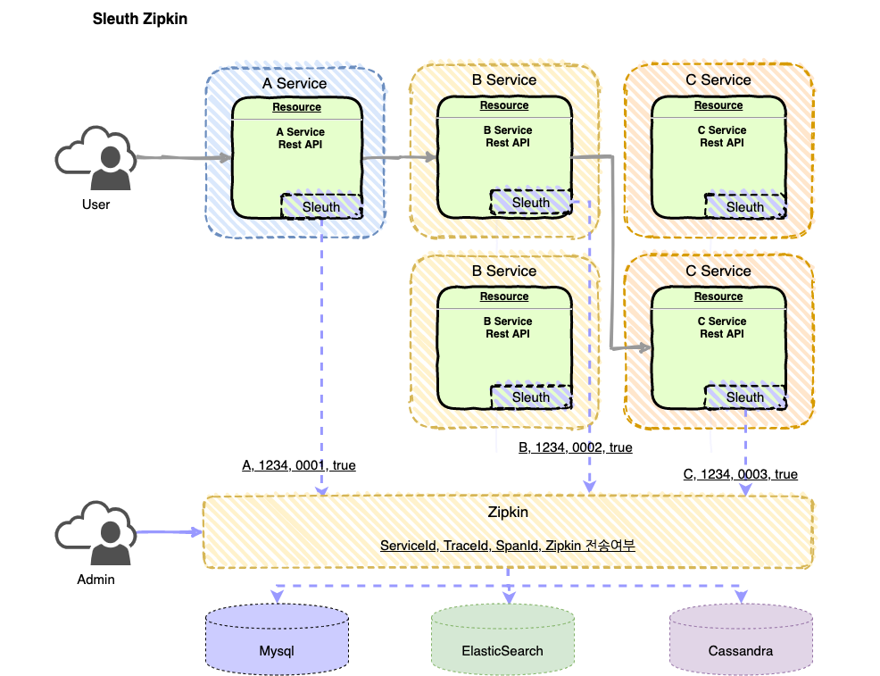
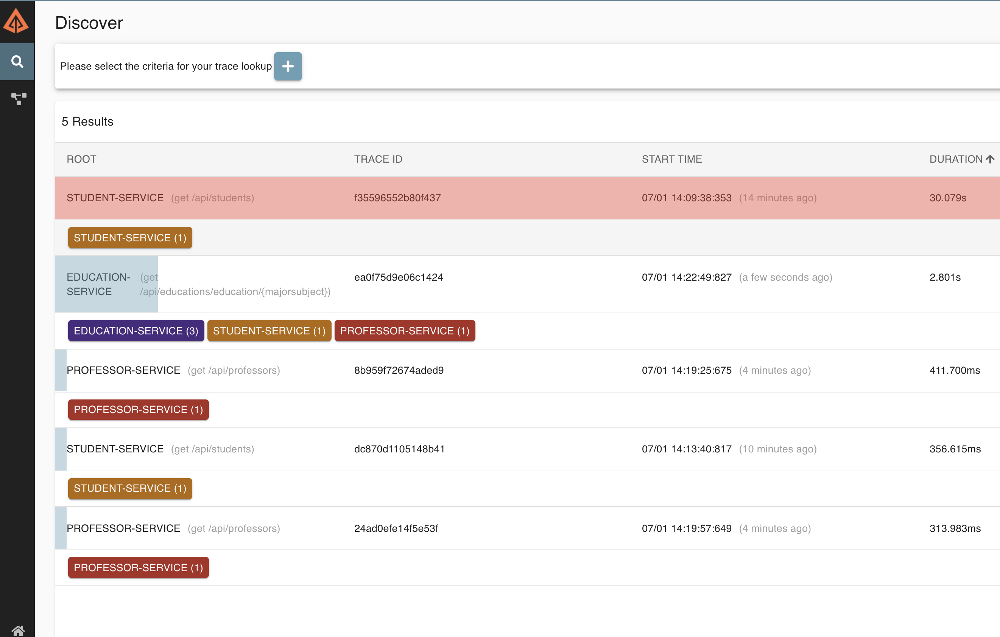
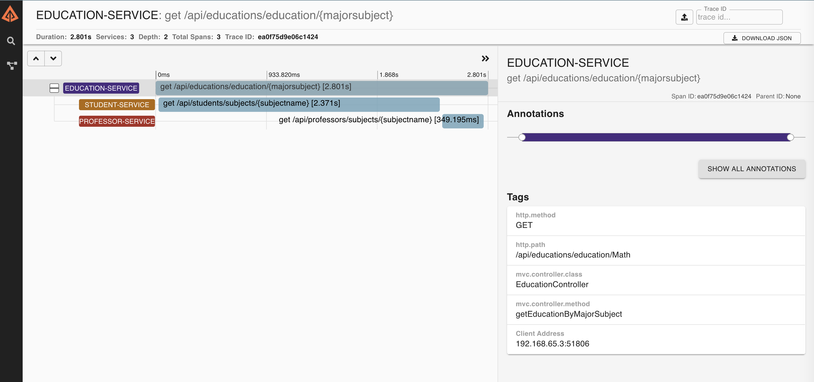
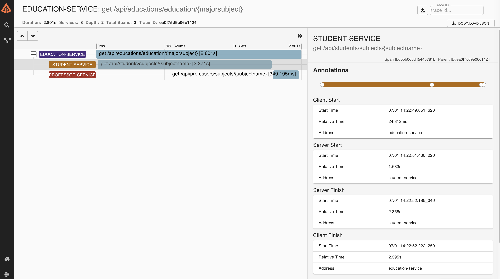

# 분산 트레이싱

MSA 에서 수십 ~ 수백대에 서버로 분산된 서버로 부터 나오는 로그를 분석해야하는 상황이 발생합니다. 

예전 Monolithic 에서 로그 트레이싱을 수행하는 작업에 비교를 할 수 없을 정도로 어려움이 있습니다 .

- 여러 인스턴스로 분산된 서비스들의 로그를 트레이싱 한다는 것은 언제 어떤 인스턴스에서, 혹은 노드에서 로그가 남는지 찾기가 무척 어렵습니다. 
- 여러 인스턴스로 넘어가는 순간 스레드 아이디 등은 의미가 없어지기 때문에 하나의 요청을 트레이싱 하기 어렵습니다. (Monolothic 에서 MDC 를 주로 활용했었습니다.)

위와 같은 어려움을 해결하기 위해 로그 트레이싱을 위한 Sleuth 가 개발 되어 활용되고 있으며, 분산된 로그를 하나로 취합하기 위해서 Zipkin 이 활용되고 있습니다. 

이제 그 내용을 자세히 알아 보겠습니다. 



전체적인 구조는 위 그림과 같습니다. 

Sleuth 가 각 서비스에 addOn 되어 있으면, log 가 남을때 위 그림과 같이 <ServiceID, TraceID, SpanID, Zipkin전송여부> 를 담고 있는 로그를 남기게 됩니다. 

Zipkin 에 연동되어 있다면 남긴 로그가 zipkin 으로 수집되게 됩니다. 

## Kubernetes with Sleuth

Sleuth는 분산 로깅을 위한 고정된 로그 포맷을 제공하기 위한 도구 입니다.  

### 의존성 설정하기. 

```text

		<dependency>
			<groupId>org.springframework.cloud</groupId>
			<artifactId>spring-cloud-starter-sleuth</artifactId>
			<version>2.2.3.RELEASE</version>
		</dependency>
```

sleuth를 위한 의존성을 추가했습니다. 

### 프로퍼티 설정하기. 

```text
spring:
  application:
    name: education-service
  sleuth:
    enabled: true
    sampler:
      probability: 1.0
```

spring.sleuth.enabled=true 로 설정하면 sleuth가 동작합니다. 
spring.sampler.probability: 1.0 은 0.1 ~ 1.0 의 값이 될 수 있으며 로그 수집 비율입니다. 1이면 전체를 수집한다는 의미입니다. 0 ~ 100로 환산됩니다. 

### 로그 확인하기.

로그 내역을 살펴보면 다음과 같습니다. 

```text
2020-06-30 15:05:56.591  INFO [education-service,237aea24f268cb57,237aea24f268cb57,false] 1 --- [nio-8281-exec-6] o.s.boot.SpringApplication               : Started application in 1.123 seconds (JVM running for 28561.496)
```

[education-service,237aea24f268cb57,237aea24f268cb57,false] 이 부분이 Sleuth가 남긴 트레이싱 로그입니다. 

[서비스아이디, TraceID, SpanID, zipkin 전송여부] 형태이며 다음과 같습니다.

- 서비스 아이디: 서비스가 발생된 서비스 이름이 출력됩니다. (application-name 값이 로깅됩니다.)
- TraceID 는 요청마다 생성되며, hop을 이동할때에도 동일하게 값을 유지합니다.
- SpanID 는 Hop이 넘어갈때마다 새로 생성됩니다. 
- zipkin 전송여부: zipkin 에 로그가 전달되었다면 true, 연동이 되지 않았다면 flase 입니다. 
 
## Kubernetes with Zipkin

이번에는 남은 로그를 zipkin 으로 전송하여 통합된 환경에서 트레이싱 해보겠습니다. 

### 의존성 추가하기. 

```text
		<dependency>
			<groupId>org.springframework.cloud</groupId>
			<artifactId>spring-cloud-starter-zipkin</artifactId>
		</dependency>
```
zipkin 의존성을 추가합니다. 

### zipkin 연동 설정하기. 

```text
spring:
    ...
  zipkin:
    base-url: http://zipkin-service:9411
```

이미 zipkin이 kubernetes 에서 수행되고 있다는 가정하에서 서비스 이름과 포트로 접근합니다. 

## 결과보기

이제 트레이싱 결과를 확인해 보겠습니다. 

http://localhost:30999/zipkin 으로 접속하여 다음과 같이 트레이싱 결과를 확인합니다. 

### 메인 로그 대시보드 



### 리퀘스트 상세보기



### 서비스내 메소드 호출관계 확인하기. 



## 결론

분산 트레이싱을 통해서 어떻게 전체 서비스에서 발생하는 로그를 취합하고, 요청에 대해서 트레이싱 하는지를 확인해 보았습니다. 

zipkin을 활용하면 매우 쉽게 분산 트레이싱을 할 수 있습니다. 

다만 zipkin 은 기본적으로 메모리에 로그를 적재하므로, mysql/elasticsearch/cassandra 등을 활용하여 로그를 퍼시스트 해야하고, 로그를 얼마 기간동안 저장할지 에이징 정책을 수립해서 관리할 필요가 있습니다. 


