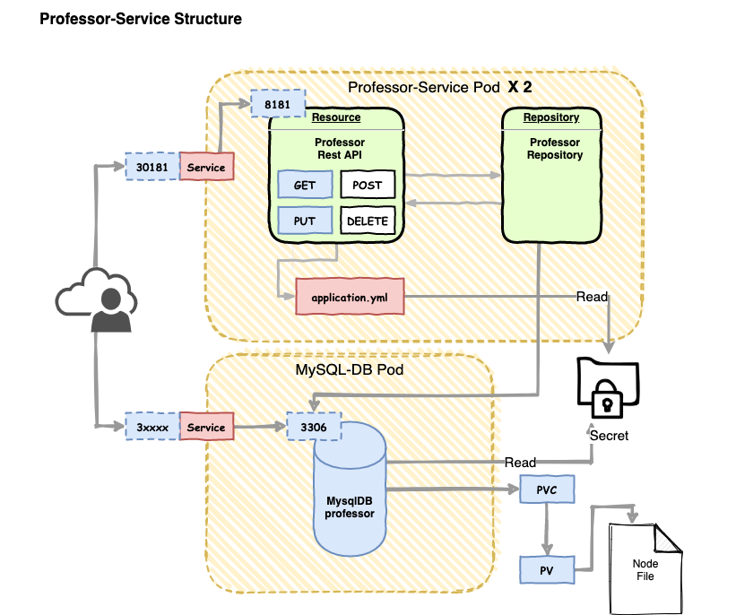

# ProfessorService

## Student-Service Overview

Professor Service 역시 Student Service 와 동일하게 다음과 같은 아키텍처 구조를 가집니다 .

 

구조는 동일하며 바뀐 부분은 MongoDB 대신에 Mysql Pod가 대체 된 것입니다. 

## 소스 구조 

다음과 같은 소스 구조를 이용 합니다. 

- professor-service
    - kubernetes: 
        - mysql-db-secret.yml: Mysql 를 사용하기 위한 name/password 를 secret로 저장하기 위한 매니페스트 파일입니다.
        - mysql-deployment.yml: Mysql 를 디플로이하고, 서비스, 볼륨을 구성하기 위한 매니페스트 파일입니다. 
        - professor-service-deployment.yml: professor-service 를 여동하기 위한 매니페스트 파일입니다. 
    - src.main.docker
        - Dockerfile: Dockerizing 을 수행하기 위한 Dockerfile 입니다. 
    - src.main.java.xxx.models: 교수 정보를 저장할 모델 클래스
    - src.main.java.xxx.repositories: 교수 정보를 저장할 리포지토리
    - src.main.java.xxx.resources: 교수 정보와 인터페이스 하기 위한 endpoint 
    - src.main.resources.http-test: 교수 서비스를 생성하고 테스트할 HTTP Client 테스트파일 
    - src.main.resources.application.yaml: 스프링 서비스를 위한 어플리케이션 프로퍼티 정보 
    - pom.xml: 의존성 관리 설정 파일 

## Professor-Service Packaging and Dockerizing (공통)

패키징 방법은 student-service 에서 지정한 maven dependency 를 참조하면 됩니다. 

## Kubernetes Secret for MysqlDB

Mysql을 위한 Secret 을 다음 과 같이 mysql-db-secret.yml 매니페스트 파일을 작성합니다. 

```text
apiVersion: v1
kind: Secret
metadata:
  name: mysql-db-secret
data:
  rootpasswd: MTIzNHF3ZXI=
  username: a2lkbw==
  password: MTIzNHF3ZXI=
```

mysql의 경우 사용자 등록을 위해서 rootpassword 도 지정해 주었습니다. 

실제 username과 password 는 professor-service 내의 repository가 접근할 수 있도록 환경변수로 전달합니다.

## Kubernetes Deploy MysqlDB

MySQLDB 를 디플로이 하기 위해서 Deployment와 Service 를 서로 연결해주고, 

Deployment Pod 와 PVC를 마운트 해줍니다.

PVC와 PV 를 바인딩하여 호스트 볼륨을 POD가 접근할 수 있도록 설정해줍니다. 

```text
apiVersion: v1
kind: Service
metadata:
  labels:
    app: mysql
  name: mysql-service
spec:
  type: NodePort
  ports:
    - name: "http"
      port: 3306
      protocol: TCP
      targetPort: 3306
      nodePort: 30306
  selector:
    service: mysql
---
apiVersion: apps/v1
kind: Deployment
metadata:
  name: mysql
spec:
  replicas: 1
  selector:
    matchLabels:
      service: mysql
  strategy:
    type: Recreate
  template:
    metadata:
      labels:
        service: mysql
      name: mysql-service
    spec:
      containers:
        - name: mysql
          image: mysql:5.6
          ports:
            - containerPort: 3306
              name: mysql
          env:
            - name: MYSQL_ROOT_PASSWORD
              valueFrom:
                secretKeyRef:
                  name: mysql-db-secret
                  key: rootpasswd
            - name: MYSQL_USER
              valueFrom:
                secretKeyRef:
                  name: mysql-db-secret
                  key: username
            - name: MYSQL_PASSWORD
              valueFrom:
                secretKeyRef:
                  name: mysql-db-secret
                  key: password
          volumeMounts:
            - mountPath: /data/mysqldb
              name: mysqldb-data
      volumes:
        - name: mysqldb-data
          persistentVolumeClaim:
            claimName: mysqldb-pvc

---
apiVersion: v1
kind: PersistentVolume
metadata:
  name: mysqldb-pv
spec:
  capacity:
    storage: 100Mi
  accessModes:
    - ReadWriteOnce
    - ReadOnlyMany
  persistentVolumeReclaimPolicy: Retain
  hostPath:
    path: /tmp/mysqldb

---
apiVersion: v1
kind: PersistentVolumeClaim
metadata:
  name: mysqldb-pvc
spec:
  resources:
    requests:
      storage: 100Mi
  accessModes:
    - ReadWriteOnce
  selector:
    matchLabels:
      name: mysqldb-pv

``` 

위 매니페스느 파일은 Service, Deployment, PV, PVC 를 모두 설정하고 있습니다. 

student-service 에서 이미 살펴본 내용입니다. 

## Kubernetes Deploy Professor-Service

이제 실제 서비스를 배포해 보겠습니다. 

```text
apiVersion: v1
kind: Service
metadata:
  name: professor-service
spec:
  type: NodePort
  selector:
    app: professor-service
  ports:
    - protocol: TCP
      port: 8181
      nodePort: 30181
---
apiVersion: apps/v1
kind: Deployment
metadata:
  name: professor-service
spec:
  replicas: 2
  selector:
    matchLabels:
      app: professor-service
  template:
    metadata:
      labels:
        app: professor-service
    spec:
      containers:
        - name: professor-service
          image: unclebae/professor-service:latest
          imagePullPolicy: Never
          ports:
            - containerPort: 8181
          env:
            - name: MYSQL_USERNAME
              valueFrom:
                secretKeyRef:
                  name: mysql-db-secret
                  key: username
            - name: MYSQL_PASSWORD
              valueFrom:
                secretKeyRef:
                  name: mysql-db-secret
                  key: password
```

위 매니페스트 파일 역시 student-service 와 동일한 것을 알 수 있습니다. 

이번에는 복제 계수를 2로 잡아 주었습니다. 교수 서비스는 학생보다 접근을 덜 한다고 가정하고 복제 계수를 적절히 설정하면 됩니다. 

### ScaleOut

매니페스트 파일의 복제 계수 수정하고 나서 기존에 생성된 pod를 scaleout 하기 위해서 를다음 명령어를 이용하면 됩니다. 

```text
kubectl apply -f professor-service-deployment.yml
```

pod가 하나더 생성이 됩니다. 

## professor-service conclusion

지금까지 professor-service 를 만들어 보았습니다. 

student-service와 동일하며, student-service 와 다른점은 db만 서로 다릅니다 .

그런데 지금까지 작업한 사항은 SpringCloud 를 Kubernetes 에 배포한 것에 불과 합니다. 

우리가 처음 논의한 SpringCloud Kubernetes 라이브러리를 아직 사용하지 않은 것이라, 이는 다음 Education-Service 에서 살펴볼 것입니다. 
