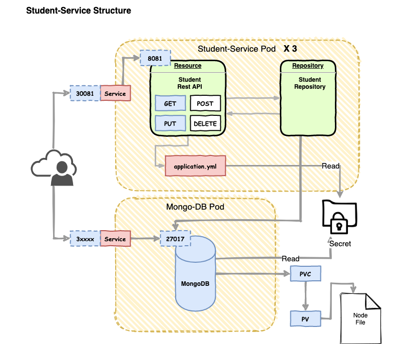

# StudentService
     
## Student-Service Overview



Student Service 구성은 위 그림과 같습니다. 

- Student Rest API: 학생 정보에 대한 CRUD 를 REST API Endpoint 를 오픈합니다. 외부 포트는 8081 로 오픈하게 됩니다. 
- Repository: 리포지토리는 MongoDB 를 이용하여 학생 정보를 저장합니다. MongoDB 와 연동할때에는 Kubernetes Secret 을 이용합니다.
- Student Service: Student 서비스를 외부로 오픈하기 위 NodeIP로 오픈합니다. 오픈하는 아이피는 30081로 오픈하여 외부 접속을 하도록 허용합니다. 
- Secret: 쿠버네티스 Secret 프로퍼티를 이용하며 MongoDB 의 username, password 를 저장합니다.  
- MongoDB: MongoDB 는 학생 정보를 저장합니다. 자신의 아이피를 27017로 서비스 합니다. 
- MongoDB Service: MongoDB 를 외부로 오픈합니다. 개발시에는 보통 DB 부분도 NodeIP 로 오픈하여 편의를 제공합니다. 별도의 NodePort 값을 지정하지 않기 때문에 Pod가 뜰때 그 값이 변경됩니다. 실제 서비스는 ClusterIP 로 클러스터 내로 한정합니다. 
- PV: (Persistent Volume) 은 쿠버네티스에서 특정 량의 스토리지를 컴포넌트가 사용할 수 있도록 제공하는 볼륨입니다. 퍼시스턴스 볼륨을 다양한 사용자의 니즈에 맞게 풀을 구성하여 컴포넌트가 필요한 양의 볼륨을 사용하도록 제공합니다.
- PVC: (Persistent Volume Claim) 은 쿠버네티스 컴포넌트 (Pod) 가 볼륨을 사용하기 위해 사용하는 논리적인 볼륨입니다. PVC 를 설정하면 PV 풀에서 요청한 리소스와 가장 적합한 PV와 연동이 됩니다. 

위 구성과 같이 student-service 를 구성하겠습니다. 

## 소스 구조 

다음과 같은 소스 구조를 이용 합니다. 

- student-service
    - kubernetes: 
        - db-secret.yml: MongoDB 를 사용하기 위한 name/password 를 secret로 저장하기 위한 매니페스트 파일입니다.
        - mongodb-deployment.yml: MongoDB 를 디플로이하고, 서비스, 볼륨을 구성하기 위한 매니페스트 파일입니다. 
        - student-service-deployment.yml: student-service 를 여동하기 위한 매니페스트 파일입니다. 
    - src.main.docker
        - Dockerfile: Dockerizing 을 수행하기 위한 Dockerfile 입니다. 
    - src.main.java.xxx.models: 학생 정보를 저장할 모델 클래스
    - src.main.java.xxx.repositories: 학생 정보를 저장할 리포지토리
    - src.main.java.xxx.resources: 학생 정보와 인터페이스 하기 위한 endpoint 
    - src.main.resources.http-test: 실제 서비스를 생성하고 테스트할 HTTP Client 테스트파일 
    - src.main.resources.application.yaml: 스프링 서비스를 위한 어플리케이션 프로퍼티 정보 
    - pom.xml: 의존성 관리 설정 파일 

## SpringCloud 의존성 설정하기

pom.xml 파일의 주요 내용을 살펴 보겠습니다. 

여기에서는 SpringCloud 를 위한 부분만 확인하겠습니다. 

```text
...
	<properties>
		<project.build.sourceEncoding>UTF-8</project.build.sourceEncoding>
		<java.version>14</java.version>
		<start-class>com.schooldevops.springcloud.kube.StudentApplication</start-class>
		<docker.image.name>unclebae/student-service</docker.image.name>
		<docker.image.tag>latest</docker.image.tag>
		<spring-cloud-dependencies.version>Hoxton.SR5</spring-cloud-dependencies.version>
	</properties>

<!-- 스프링클라우드 의존성 관리 설정을 아래와 같이 수행합니다. --> 
	<dependencyManagement>
		<dependencies>
			<dependency>
				<groupId>org.springframework.cloud</groupId>
				<artifactId>spring-cloud-dependencies</artifactId>
				<version>${spring-cloud-dependencies.version}</version>
				<type>pom</type>
				<scope>import</scope>
			</dependency>
		</dependencies>
	</dependencyManagement>

	<dependencies>
        <!-- Rest API 를 위한 의존성 추가 --> 
		<dependency>
			<groupId>org.springframework.boot</groupId>
			<artifactId>spring-boot-starter-web</artifactId>
		</dependency>

		...
    
        <!-- Spring actuator 를 활용하여 다양한 메트릭을 확인할 수 있습니다.  --> 
		<dependency>
			<groupId>org.springframework.boot</groupId>
			<artifactId>spring-boot-actuator</artifactId>
		</dependency>
		<dependency>
			<groupId>org.springframework.boot</groupId>
			<artifactId>spring-boot-actuator-autoconfigure</artifactId>
		</dependency>

        <!-- Spring Data MongoDB를 통해서 mongoDB와 연동할 수 있습니다.   -->     
		<dependency>
			<groupId>org.springframework.boot</groupId>
			<artifactId>spring-boot-starter-data-mongodb</artifactId>
		</dependency>
...
``` 

위 내용은 SpringCloud 를 위한 의존성 관리를 지정했습니다. 이렇게 의존성 관리를 수행하면, 구체적인 각각의 의존성 모듈들의 버젼을 작성할 필요없이 의존성 관리 설정으로 통일화 할 수 있습니다. 

이런 의존성 관리 모듈을 추가하거나, 혹은 parent 를 설정하면 라이브러리 버젼 충돌 없이 안정화된 서비스를 제공할 수 있습니다. 

## Student-Service Packaging and Dockerizing

컨테이너 기반 어플리케이션을 위해서 Dockerfile 을 이용하여 도커라이징을 해 주어야 합니다. 

우리는 이러한 컨테이너 이미지를 도커라이징 하기 위해서 maven 툴을 활용합니다. 

pom.xml 파일에서 docker 를 위한 설정은 다음과 같습니다 .

### maven 설정하기 

```text
	<properties>
		<project.build.sourceEncoding>UTF-8</project.build.sourceEncoding>
		<java.version>14</java.version>
		<start-class>com.schooldevops.springcloud.kube.StudentApplication</start-class>
           
        <!-- docker 용 이미지 이름과 태깅을 설정합니다. --> 
		<docker.image.name>unclebae/student-service</docker.image.name>
		<docker.image.tag>latest</docker.image.tag>
		
        <spring-cloud-dependencies.version>Hoxton.SR5</spring-cloud-dependencies.version>
	</properties>

	...

	<dependencies>
		...
        <!-- Dockerizing 을 위한 의존성 설정 spotify 가 생성한 자동화 툴을 활용합니다. --> 
		<dependency>
			<groupId>com.spotify</groupId>
			<artifactId>docker-maven-plugin</artifactId>
			<version>1.2.2</version>
		</dependency>
        ...
	</dependencies>

	<build>
		<plugins>
            <!-- 사용할 Dockerfile 설정을 위한 부분 --> 
			<plugin>
				<artifactId>maven-resources-plugin</artifactId>
				<executions>
					<execution>
						<id>copy-resources</id>
						<!-- here the phase you need -->
						<phase>validate</phase>
						<goals>
							<goal>copy-resources</goal>
						</goals>
						<configuration>
							<outputDirectory>${basedir}/target/dockerfile</outputDirectory>
							<resources>
								<resource>
									<directory>src/main/docker</directory>
									<filtering>true</filtering>
								</resource>
							</resources>
						</configuration>
					</execution>
				</executions>
			</plugin>

            <!-- 사용할 package 정보를 설정을 위한 부분 --> 
			<plugin>
				<groupId>com.spotify</groupId>
				<artifactId>docker-maven-plugin</artifactId>
				<version>1.2.2</version>
				<configuration>
					<imageName>${docker.image.name}:${docker.image.tag}</imageName>
					<dockerDirectory>${basedir}/target/dockerfile</dockerDirectory>
					<resources>
						<resource>
							<targetPath>/</targetPath>
							<directory>${project.build.directory}</directory>
							<include>${project.build.finalName}.jar</include>
						</resource>
					</resources>
				</configuration>
			</plugin>
			...
		</plugins>
	</build>
```

### Dockerfile 작성하기

```text
FROM openjdk:14-jdk-alpine
VOLUME /tmp
RUN apk update && apk upgrade && apk add netcat-openbsd
RUN mkdir -p /usr/local/app
ADD @project.build.finalName@.jar /usr/local/app/
WORKDIR /usr/local/app
CMD java -jar @project.build.finalName@.jar --server.port=8081

```

### Dockerizing 명령

우리는 다음과 같은 maven 명령어를 통해서 한번에 이미지를 생성해 낼 수 있습니다. 

```text
mvn clean package docker:build
```

### 생성된 docker 파일 확인하기. 

```text
docker images --filter=reference='unclebae/student-service:*'
REPOSITORY                 TAG                 IMAGE ID            CREATED             SIZE
unclebae/student-service   latest              f700d37e8715        4 hours ago         409MB
```

지정한 docker 이미지 이름에 대해서 확인이 가능합니다. 

## Student-Service with Mongodb

student-service 는 mongodb 를 사용합니다. 

Spring Data MongoDB 를 이용하면, 매우 간편하게 데이터를 mongoDB 에 저장하고 조회할 수 있습니다. 

### MongoDB 설정하기. 

application.yaml 파일을 다음과 같이 설정합니다. 

```text
...
spring:
  data:
    mongodb:
      host: mongodb-service
      port: 27017
      database: admin
      username: ${MONGO_USERNAME}
      password: ${MONGO_PASSWORD}

...
```

- host: mongodb-service
    - 위와 같이 설정하면, kubernetes의 pod container 이름을 찾아서 접속하게 됩니다. 
- username: ${MONGO_USERNAME}
    - ${MONGO_USERNAME} 을 통해서 컨테이너 외부에서 환경변수로 전달한 값으로 대체할 수 있습니다. 
- password: ${MONGO_PASSWORD}
    - 위와 동일합니다. 
    
### Student Model 작성하기. 

MongoDB 는 Document Base NoSQL 입니다. Spring Data MongoDB 를 활용하기 위해서 모델이 Document로 인식하도록 다음과 같이 작업해 줍니다. 

```text
package com.schooldevops.springcloud.kube.models;

import lombok.*;
import org.springframework.data.annotation.Id;
import org.springframework.data.mongodb.core.mapping.Document;
import org.springframework.data.mongodb.core.mapping.Field;

import java.math.BigInteger;

@Getter
@Setter
@NoArgsConstructor
@AllArgsConstructor
@Builder
@ToString
@Document(collection = "students")
public class Student {

    @Id
    private BigInteger id;

    private String name;

    private Integer age;

    private String address;

    @Field("major_subject")
    private String majorSubject;

}
``` 

@Document 어노테이션으로 MongoDB 도큐먼트라는 것을 설정합니다. 

@Id 를 지정하면 도큐먼트의 키를 설정합니다. 

### Repository 작성하기. 

```text
package com.schooldevops.springcloud.kube.repositories;

import com.schooldevops.springcloud.kube.models.Student;
import org.springframework.data.mongodb.repository.MongoRepository;

import java.math.BigInteger;
import java.util.List;

public interface StudentRepository extends MongoRepository<Student, BigInteger> {

    List<Student> findByMajorSubject(String majorSubject);
}
```

MongoRepository를 상속하는 것만으로 위 인터페이스는 기본적인 CRUD 를 자동으로 생성해 줍니다. 

### Resource 엔드포인트

엔드포인트는 다음과 같이 지정했습니다. 

```text
@RestController
@RequestMapping("/api/students")
public class StudentController {

    @Autowired
    private StudentRepository studentRepository;

    @GetMapping
    public List<Student> findAll() {
        ...
    }

    @PostMapping
    public Student saveStudent(@RequestBody Student student) {
        ...
    }

    @PutMapping("/{id}")
    public Student updateStudent(@PathVariable("id") BigInteger id, @RequestBody Student student) {
        ...
    }

    @GetMapping("/subjects/{subjectName}")
    public List<Student> findBySubjectName(@PathVariable("subjectName") String subjectName) {
        ...
    }

    @GetMapping("/{id}")
    public Student findById(@PathVariable("id") BigInteger id) {
        ...
    }

    @DeleteMapping("/{id}")
    public void deleteById(@PathVariable("id") BigInteger id) {
        ...
    }
}
```

지금까지 작성한 코드를 docker 이미지를 생성하고 나면 컨테이너 준비가 완료 됩니다. 

```text
mvn clean package docker:build
```

## Kubernetes Secret 

이제 MongoDB 를 위한 name/password 를 kubernetes secret 에 저장할 차례 입니다. 

kubernetes 에서는 secret 을 통해서 민감한 정보를 저장할 수 있습니다. 

### name / password 생성해 내기

secret 정보는 기본적으로 base64로 인코딩 하여 secret 에 저장합니다.

pod가 secret 정보를 사용할 때 내부적으로 base64로 디코딩 하여 해당 값을 이용합니다. 

다음과 같이 인코딩한 데이터를 만들겠습니다. 

```text
$ echo -n 'kido' | base64
a2lkbw==

$ echo -n '1234qwer' | base64
MTIzNHF3ZXI=
```

위와 같이 인코딩이 가능합니다. 

디코딩은 다음과 같이 수행하면 됩니다. 

```text
$ echo 'a2lkbw==' | base64 --decode
kido

$ echo 'MTIzNHF3ZXI=' | base64 --decode
1234qwer
```

### secret.yaml manifest 작성하기. 

이제는 secret 을 위한 매니페스트 파일을 다음과 같이 만듭니다. 

```text
apiVersion: v1
kind: Secret
metadata:
  name: db-secret
data:
  username: a2lkbw==
  password: MTIzNHF3ZXI=
```

- kind: Secret 으로 지정하여, Secret 설정 파일을 등록하는 것으로 kubenernetes 에 알려줄 수 있습니다. 
- apiVersion: 이 버젼은 kind에서 지정한 Secret 을 제공하는 api 의 버젼을 지정합니다. secret은 v1 입니다.
- metadata: 은 리소스의 이름을 지정합니다. db-secret 으로 지정했습니다. 
- data: 하위에 key:value 값으로 지정할 수 있으며, 위에서 생성한 base64 인코딩 값을 각각 지정해 줍니다. 

### Secret 등록하기. 

```text
kubectl create -f db-secret.yaml 
```

create 옵션으로 kubernetes 에 등록 합니다. 

```text
$kubectl get secret
NAME                  TYPE                                  DATA   AGE
db-secret             Opaque                                2      5h5m
default-token-lvsqh   kubernetes.io/service-account-token   3      8d

```

등록된 secret 목록을 확인할 수 있습니다. 

```text
$kubectl describe secret db-secret
Name:         db-secret
Namespace:    default
Labels:       <none>
Annotations:  <none>

Type:  Opaque

Data
====
password:  8 bytes
username:  4 bytes

```

describe 옵션을 통해서 구체적인 secret 정보를 확인할 수 있습니다. 

위 결과를 보면 secret 답게 암호화 된 값을 보여주지 않습니다. 

## Kubernetes Deploy Mongodb

이제는 mongoDB 를 디플로이 해보겠습니다.

mongoDB 는 최신 docker repository 에서 이미지를 가져와서 설치합니다. 

mongodb-deployment.yml 파일을 아래와 같이 작성해 줍니다. 

### mongoDB service 등록

```text
apiVersion: v1
kind: Service
metadata:
  labels:
    app: mongo
  name: mongodb-service
spec:
  type: NodePort
  ports:
    - name: "http"
      port: 27017
      protocol: TCP
      targetPort: 27017
  selector:
    service: mongo
``` 

### mongoDB 디플로이하기 

```text
apiVersion: apps/v1
kind: Deployment
metadata:
  name: mongo
spec:
  replicas: 1
  selector:
    matchLabels:
      service: mongo
  template:
    metadata:
      labels:
        service: mongo
      name: mongodb-service
    spec:
      containers:
        - name: mongo
          image: mongo:latest
          args:
            - mongod
          env:
            - name: MONGO_INITDB_ROOT_USERNAME
              valueFrom:
                secretKeyRef:
                  name: db-secret
                  key: username
            - name: MONGO_INITDB_ROOT_PASSWORD
              valueFrom:
                secretKeyRef:
                  name: db-secret
                  key: password
          volumeMounts:
            - mountPath: /data/db
              name: mongodb-data
      volumes:
        - name: mongodb-data
          persistentVolumeClaim:
            claimName: mongodb-pvc
```

### mongoDB 를 위한 volume 등록하기 

mongoDB 데이터가 저장될 스토리지를 등록해 주어야합니다. 

컨테이너의 경우 컨테이너가 내려가면 해당 컨테이너 내부의 모든 데이터는 삭제 되므로 Volume 를 연동해 주어야 저장된 데이터를 유지할 수 있습니다. 

이것을 Persistent 라고 합니다. 

#### PV 등록

PV는 MongoDB 를 위한 볼륨을 지정합니다. 이 볼륨은 사실은 관리자가 지정해 주는 것이지만 여기서는 직접 지정하여 사용하도록 하겠습니다. 

hostPath는 호스트 서버의 파일을 볼륨으로 사용하겠다는 의미입니다. 

이러한 볼륨 타입은 emptyDir, hostPath, gcePersistentDisk, awsElasticBlockStore, azureDiskVolume, nfs, isci, flocker, glusterfs, rbd, cephfs, gitRepo, secret 등을 지정할 수 있습니다.  

```text
apiVersion: v1
kind: PersistentVolume
metadata:
  name: mongodb-pv
spec:
  capacity:
    storage: 100Mi
  accessModes:
    - ReadWriteOnce
    - ReadOnlyMany
  persistentVolumeReclaimPolicy: Retain
  hostPath:
    path: /tmp/mongodb
```

#### PVC 등록

PVC 는 PV와 바인딩 되는 논리적인 구성요소이며, Pod와 PV 를 상호 연결해 줍니다. 

```text
apiVersion: v1
kind: PersistentVolumeClaim
metadata:
  name: mongodb-pvc
spec:
  resources:
    requests:
      storage: 100Mi
  accessModes:
    - ReadWriteOnce
  selector:
    matchLabels:
      name: mongodb-pv
```

### mongodb 디플로이 

```text
$kubectl create -f mongodb-deployment.yml
```

```text
$kubectl get pods | grep mongo
mongo-669bc9f68f-4rctj               1/1     Running   0          5h22m
```
정상으로 등록되었습니다. 

## Kubernetes Deployment

kubernetes 에서 kind 가 Deployment 는 컨테이너를 단순히 pod 로 배포하는 것을 넘어서, 복제계수에 딸 원하는 pod의 상태를 관리하고, 배포 버젼을 관리하도록 해줍니다. 

```text
$kubectl get deployment
NAME                READY   UP-TO-DATE   AVAILABLE   AGE
mongo               1/1     1            1           5h27m

```

위 결과와 같이 mongoDB pod 의 READY 1/1은 (현재 수행되는 pod수) / (요청하는 pod수) 를 나타냅니다. 

즉 강제로 mongo pod 제거하면 deployment 에서 지정한 replicas 개수만큼을 유지하기 위해서 pod를 개수만큼 running 상태로 만듭니다. 

```text
$kubectl rollout history deployment mongo
deployment.apps/mongo 
REVISION  CHANGE-CAUSE
1         <none>

```

위 명령을 통해서 디플로이 될때 리비젼 정보를 확인 할 수 있습니다. 

우리는 최초로 배포했기 때문에 REVISION이 1입니다. 

```text
$kubectl rollout undo  deployment mongo --to-revision=1
```

위 명령을 통해서 원하는 리비젼으로 롤백할 수 있습니다. 
 

## Kubernetes Service

Kubernetes 에서 Service 는 원하는 Pod와 외부를 연결시켜 주는 역할을 합니다. 

처음 소개드린 Overview 에서 보았듯이 서비스를 등록하여 student-service 를 외부로 연결하였습니다. 

Service 의 타입은 LoadBalancer, NodePort, ClusterIp 로 설정할 수 있습니다. 

- LoadBalancer 의 경우 Cloud 에 배포할때 클라우드의 로드밸런서와 연동하도록 해줍니다. LoadBalancer 가 구성되어 있지 않는경우 NodePort와 동일하게 동작합니다. 
- NodePort는 노드 외부와 Pod 를 연결해 줍니다. 우리 코드에서는 NodePort와 Pod의 컨테이너 포트를 서로 포트포워딩 해 주었습니다. 
- ClusterIp 는 클러스터 내에서 localhost처럼 상호 접근할 수 있도록 하는 내부 인터페이스를 연결합니다. 이를 통해서 Pod 간의 통신은 localhost:port 로 직접 통신할 수 있습니다. 

### 예시

```text
apiVersion: v1
kind: Service
metadata:
  name: student-service
spec:
  type: NodePort
  selector:
    app: student-service
  ports:
    - protocol: TCP
      port: 8081
      nodePort: 30081
```

위 예시와 같이 student-service 라는 서비스를 생성합니다. 

타입은 NodePort로 노드 외부와 Pod를 연결해 줍니다. 이때 nodePort는 외부에서 접근하는 포트이며, 이 포트로 요청이 들어오면 내부의 8081로 포워딩 해 주게 됩니다. 

## Kubernetes Deploy Student-Service

이제 Student-Service 를 배포해 보겠습니다. 

student-service-deployment.yml 파일을 다음과 같이 작성해 줍니다. 

### 서비스 등록 

```text
apiVersion: v1
kind: Service
metadata:
  name: student-service
spec:
  type: NodePort
  selector:
    app: student-service
  ports:
    - protocol: TCP
      port: 8081
      nodePort: 30081
```

이 내용은 이전에 설명했습니다. 

### Deployment 수행하기 
 
```text
apiVersion: apps/v1
kind: Deployment
metadata:
  name: student-service
spec:
  replicas: 3
  selector:
    matchLabels:
      app: student-service
  template:
    metadata:
      labels:
        app: student-service
    spec:
      containers:
        - name: student-service
          image: unclebae/student-service:latest
          imagePullPolicy: Never
          ports:
            - containerPort: 8081
          env:
            - name: MONGO_USERNAME
              valueFrom:
                secretKeyRef:
                  name: db-secret
                  key: username
            - name: MONGO_PASSWORD
              valueFrom:
                secretKeyRef:
                  name: db-secret
                  key: password
```

여기서 눈여겨 볼것은 kind가 Deployment 라는 것입니다. 우리는 디플로이먼트를 통해서 원하는 리플리카를 설정하여 Pod의 개수를 유지하게 모니터링 하게 하고, 배포시에 리비젼을 관리하게 됩니다. 

그리고 중요한 포인트는 imagePullPolicy 값입니다. 우리는 로컬 이미지를 사용할 것이기 때문에 Never 로 설정했습니다. 

env 값은 컨테이너의 환경변수로 전달할 내용을 지정 하고 있습니다. 

valueFrom 을 활용하여 db-secret 이라는 secret 을 조회합니다. 그리고 거기에 name / password 값을 읽어오도록 설정했습니다. 

```text
$kubectl create -f student-service-deployment.yml 
```

위와 같이 실행하면 다음과 같이 pod 내용을 살펴 볼 수 있습니다 .

```text
$kubectl get deployment student-service
NAME              READY   UP-TO-DATE   AVAILABLE   AGE
student-service   3/3     3            3           5h25m
```

리플리카 3개가 모두 정상으로 실행되고 있습니다. 

```text
$kubectl get pod | grep student-service
NAME                                 READY   STATUS    RESTARTS   AGE
student-service-65c46b8cf7-9fvb2     1/1     Running   0          5h25m
student-service-65c46b8cf7-hhhrn     1/1     Running   0          5h25m
student-service-65c46b8cf7-pwvg2     1/1     Running   0          5h25m
```

pod 관점으로 보면 3개가 모두 수행중입니다. 

```text
$kubectl get service | grep student-service
NAME                TYPE        CLUSTER-IP       EXTERNAL-IP   PORT(S)           AGE
student-service     NodePort    10.101.185.85    <none>        8081:30081/TCP    5h26m
```

위처럼 서비스도 NodePort 로 동작하고, 포트는 외부 포트 30081 --> 내부포트 8081 로 포워딩 됨을 확인할 수 있습니다.

## student-service conclusion

지금까지 mongodb - springcloud 를 활용하여 서비스를 띄웠습니다. 

그리고 service 와 pod 를 연동하기 위해서 NodePort 를 이용하여, 외부로 포트를 오픈했습니다. 

또한 PV, PVC 를 활용하여 데이터베이스 저장 파일을 외부 볼륨에 마운트 하여 안전하게 데이터를 보호할 수 있도록 설정해 보았습니다. 

 